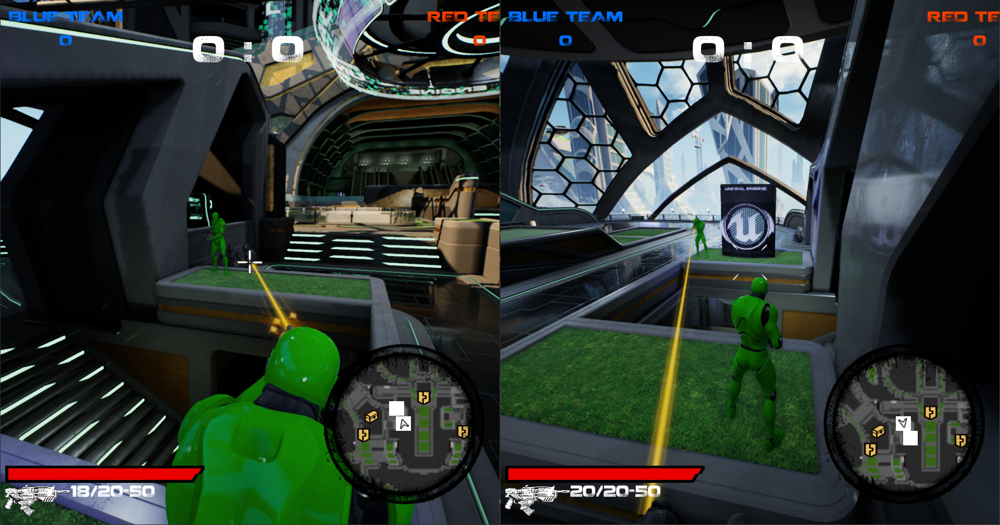
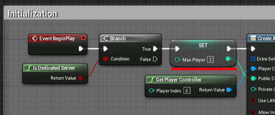
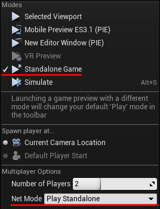

# Third Person Shooter Multi
Alex FIGUEIREDO & Sami AMARA

## Description
This is a variation of Unreal's TPS template, in which multiplayer was implemented.

## How to test
### From scripts
0. Open the Unreal project, and set the maximum number of players in `Content/Blueprints/GameModes/LobbyGM_BP.uasset` to your liking (2 by default)

1. Launch a dedicated server with `StartDedicatedServer.bat`
2. Launch as many clients as the maximum amount of players previously set in LobbyGM_BP
3. Play

### From the Unreal editor
0. Open the Unreal project, and set the maximum number of players in `Content/Blueprints/GameModes/LobbyGM_BP.uasset` to your liking (2 by default)
1. Launch a dedicated server with `StartDedicatedServer.bat`
2. Set the play settings and mode as follow:

To test

3. Set the number of players to the value of `MaxPlayer`
4. Play the game

## What is done and not done
### Done
- [x] All players states are replicated:
    - Movements
    - Walking
    - Running
    - Jumping
    - Punching
    - Aiming
    - Shooting
    - Reloading
    - Pressing button
    - Spawning and dying

- [x] All previously non-replicated map features are replicated:
    - Ammo pickups
    - Health packs
    - Button's effect

- [x] Synchronized physics cube between players

- [x] Pre-game networked lobby with:
    - Team selection
    - Identification with a username
    - Ready poll before launching the game
    - Seamless travel with transition to the game map (Highrise)

### Not done
- [ ] The travel from the lobby to the Highrise game map does not forwards and assign the correct team to each player. Every client it put into the same team. **The replication of the shooting action, damages, death, etc. can still be tested by launching 2 clients within the Unreal Editor while the Highrise map is active in the editor**
- [ ] Not "back" button in the lobby interface
- [ ] Time and score replication
- [ ] Player with their kills/deaths/assists in a list
- [ ] In-game events (kills, kill streaks, etc.)
- [ ] Victory and defeat events
- [ ] Lag compensation implementation
- [ ] Extra Gameplay implementation
- [ ] Online services implementation

## Architecture
- In-game replication is implemented entirely in the provided C++ classes (especially `ShooterCharacter` and `UWeaponComponent` among others)
- Lobby replication is implemented partly in new C++ classes (`LobbyPS`, `LobbyGS`, `LobbyGM`), and partly within blueprint (see blueprints derived from theses classes in `Content/Blueprints/GameModes/`, `Content/Blueprints/States/` and `Content/Blueprints/Controllers/`

## Known bugs
- Spamming the reload button while jumping can shorten the jump duration, thus lowering the apex of the jump
- When a client joins a lobby where at least 1 client which has already joined a team, all the "Join" buttons under a team's list may be disabled
- When there are 2+ clients connected in a lobby and all of the clients have joined a team,
clicking the Ready button and then clicking "Unjoin" de-synchronizes the ready poll, and prevents the client who clicked "Unjoin" from telling that they are ready again